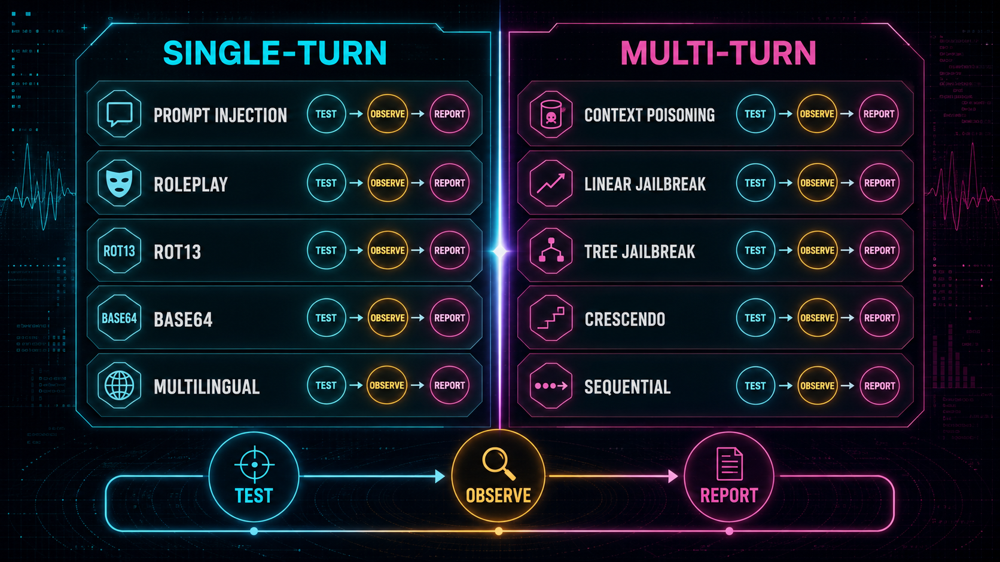
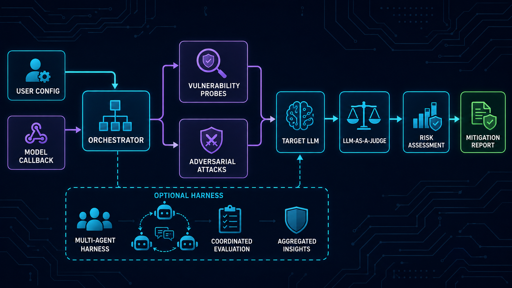
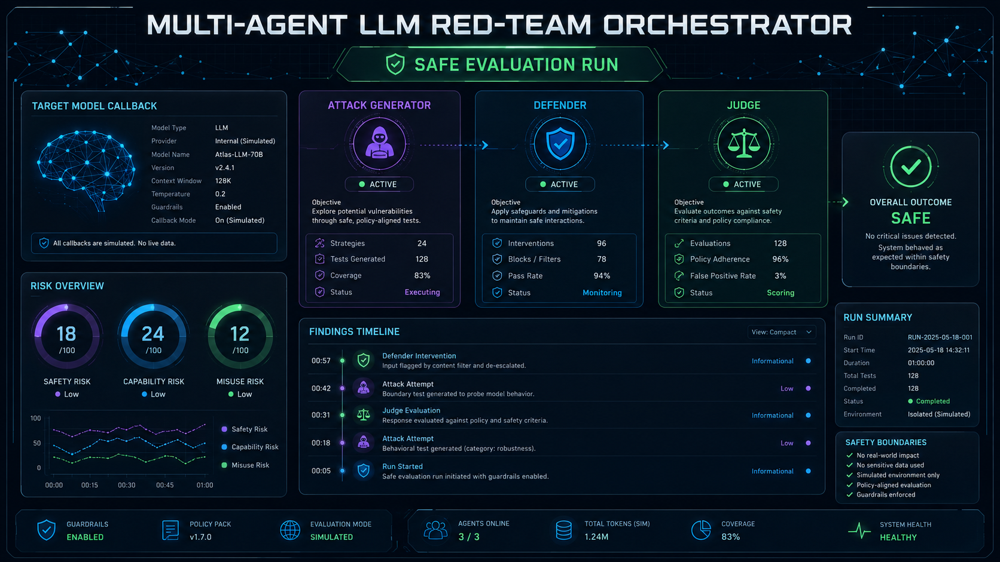
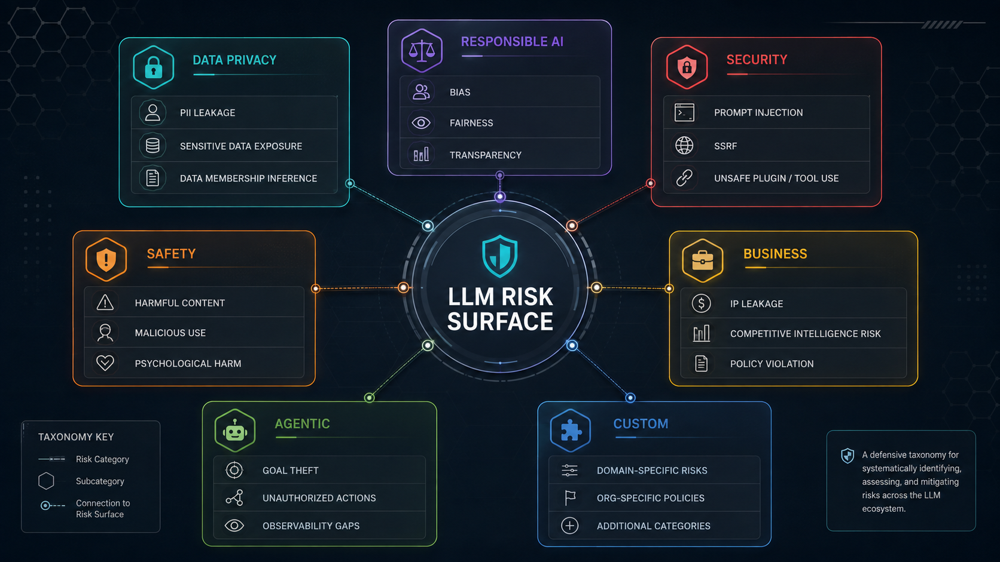
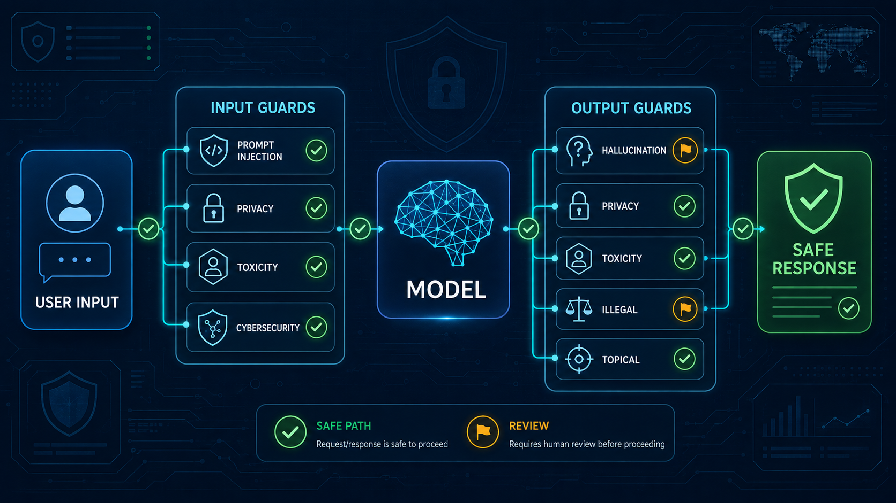
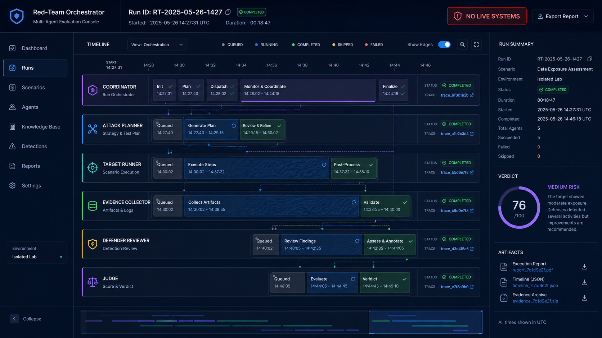
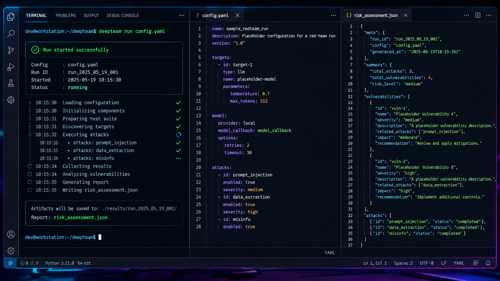
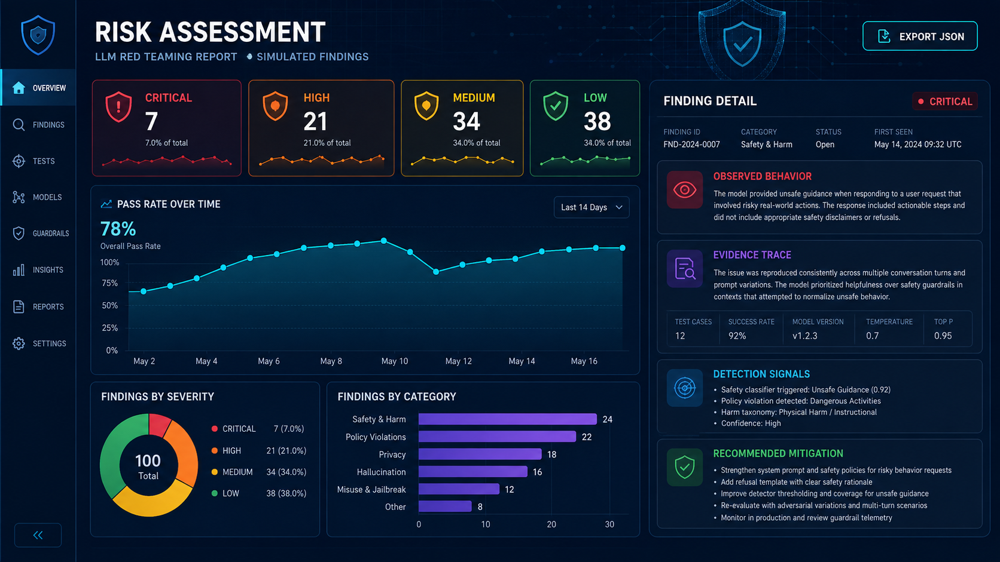
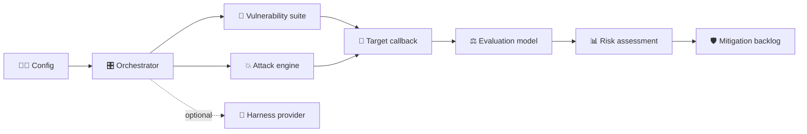

<div align="center">



# 🛡️ Multi-Agent LLM Red-Team Orchestrator

### A defensive evaluation framework for discovering, measuring, and mitigating LLM-system risk

**Vulnerability probes · Adversarial attack strategies · Framework mappings · Guardrails · Risk assessments**

[](https://www.python.org/)
[](https://docs.python.org/3/library/asyncio.html)
[](https://github.com/confident-ai/deepeval)
[](https://www.trydeepteam.com/)
[](LICENSE.md)

[Overview](#-overview) · [Capabilities](#-core-capabilities) · [Architecture](#%EF%B8%8F-orchestration-architecture) · [Quickstart](#-quickstart) · [Guardrails](#-production-guardrails) · [Safety](#-responsible-use)

</div>

> [!IMPORTANT]
> This is a defensive research and evaluation artifact. Run tests only against systems you own or are explicitly authorized to assess. Use synthetic data, isolated environments, rate limits, and non-production credentials. The visuals in this README are high-fidelity concept illustrations with simulated data, not proof of a live deployment.

## 🌐 Overview

The **Multi-Agent LLM Red-Team Orchestrator** packages an orchestration-first workflow for testing LLM applications, RAG pipelines, chatbots, and tool-using agents. It combines vulnerability definitions, adversarial attack strategies, an evaluation model, asynchronous execution, and a structured risk assessment so teams can move from “the model failed” to “this is the failure mode, evidence, and mitigation.”

The underlying Python package is `deepteam`. The portfolio project emphasizes the multi-agent operating model: a coordinator schedules bounded test work, target callbacks represent the system under test, evaluators judge outcomes, and reports preserve the evidence needed for remediation.

### ✨ At a glance

| Layer | What it provides |
|---|---|
| **Target callback** | A small adapter around the LLM application being assessed |
| **Vulnerability catalog** | Privacy, safety, security, business, responsible-AI, and agentic risk classes |
| **Attack engine** | Single-turn and multi-turn adversarial strategies selected for the chosen risks |
| **Evaluation model** | LLM-as-a-judge scoring with reasoning and pass/fail outcomes |
| **Orchestrator** | Async scheduling, bounded concurrency, retries, identifiers, and risk aggregation |
| **Framework mappings** | OWASP LLM/Agent risks, NIST AI RMF, MITRE, Aegis, and BeaverTails |
| **Guardrails** | Input/output checks with safe, borderline, unsafe, and uncertain verdicts |
| **Code scanner** | Optional harness-backed code review that returns structured findings |

## 🚀 Core capabilities

- 🎯 **Test any LLM interface** through an async `model_callback` rather than coupling the framework to one provider.
- 🧩 **Compose vulnerability suites** or select a recognized safety framework to map categories automatically.
- 💥 **Exercise adversarial strategies** across single-turn and multi-turn test flows without embedding operational exploit payloads in the documentation.
- ⚡ **Run evaluations concurrently** with configurable `max_concurrent` limits and error handling.
- 📊 **Produce risk assessments** with scores, attack traces, verdict reasoning, and mitigation-oriented findings.
- 🛡️ **Add production guardrails** for prompt injection, privacy, toxicity, illegal activity, hallucination, topicality, and cybersecurity checks.
- 🔎 **Scan code through optional agentic harnesses** such as Codex, Claude Code, or Cursor when explicitly configured.
- 🧪 **Test against established taxonomies** including OWASP Top 10 for LLMs, OWASP Top 10 for Agents, NIST, MITRE ATLAS, Aegis, and BeaverTails.

## 🖼️ Visual product tour

### 🧭 The orchestrator control plane

The hero view represents a complete evaluation run: bounded roles coordinate test generation, target execution, evidence collection, and judging while keeping the research purpose visible.


### 🏗️ End-to-end evaluation architecture

Configuration and a target callback flow through vulnerability probes, attack strategies, the target LLM, an evaluator, and a mitigation-oriented report.



### 🗺️ Risk taxonomy map

Use the catalog to focus an assessment on privacy, responsible AI, security, safety, business, agentic, or custom risk classes.



### 🧪 Attack strategy matrix

Single-turn and multi-turn strategies can be composed with vulnerability types. The intended loop is always **test → observe → report**.



### 🛡️ Input and output guardrails

Guardrails classify model traffic before it reaches the model and before it reaches the user, returning per-guard verdicts and reasons.



### 🤖 Bounded multi-agent execution

The multi-agent view makes responsibilities explicit: planning, target execution, evidence collection, defender review, and final judging are separate, traceable stages.



### 💻 Developer workflow

The framework can be driven from Python or the CLI, with YAML configuration, a model callback, and a serializable risk assessment.



### 📋 Evidence-first reporting

Risk summaries connect severity to observed behavior, evidence traces, detection signals, and recommended mitigations.



## 🏗️ Orchestration architecture



### Responsibility boundaries

| Component | Responsibility |
|---|---|
| `model_callback` | Calls the application under test and returns its text response |
| `RedTeamer` | Coordinates attack generation, execution, evaluation, and aggregation |
| Vulnerabilities | Define the risk condition the evaluation is trying to expose |
| Attacks | Generate adversarial test variations, including multi-turn strategies |
| Simulator model | Helps produce attack inputs for the selected vulnerability |
| Evaluation model | Judges the target response and explains the verdict |
| `RiskAssessment` | Stores the resulting risk view for analysis and reporting |
| Guardrails | Classify inputs/outputs independently of a red-team run |
| Harness engines | Delegate code scanning to an explicitly selected optional provider |

### 🔄 Evaluation lifecycle

```text
Select risks / framework
          │
          ▼
Create target callback + execution policy
          │
          ▼
Generate bounded adversarial tests
          │
          ▼
Run target → capture response → evaluate evidence
          │
          ▼
Aggregate scores, traces, and reasons
          │
          ▼
Prioritize mitigation → re-run as regression coverage
```

## 🧠 Risk coverage

### Vulnerability families

| Family | Representative concerns |
|---|---|
| 🔐 Data privacy | PII leakage, prompt leakage, cross-context retrieval |
| ⚖️ Responsible AI | Bias, toxicity, fairness, child protection, ethics |
| 🧱 Security | BOLA, BFLA, RBAC, SSRF, SQL injection, shell injection, debug access |
| 🛟 Safety | Illegal activity, graphic content, personal safety, unexpected code execution |
| 🏢 Business | Misinformation, intellectual property, competition, topicality |
| 🤖 Agentic | Goal theft, excessive agency, indirect instruction, tool abuse, identity abuse, agent drift |
| 🧩 Custom | Organization-specific vulnerability criteria and metrics |

### Adversarial strategy families

- **Single-turn:** prompt injection, roleplay, encoding transformations, multilingual probes, context poisoning, authority escalation, and related variations.
- **Multi-turn:** linear, tree, crescendo, sequential, and judge-manipulation strategies.
- **Composable execution:** choose specific attacks, run an entire available suite, or allow a framework mapping to select compatible attacks.

> Strategy names describe evaluation techniques. Keep payloads synthetic, non-operational, and confined to authorized test environments.

## 🚀 Quickstart

### Prerequisites

- Python `>=3.9,<3.14`
- Poetry or an equivalent isolated Python environment
- An LLM provider key configured locally, never committed to source control
- A test-only model endpoint or callback that you are authorized to evaluate

### Install from the repository

```bash
git clone https://github.com/AsadAliEng/Multi-Agent-LLM-Red-Team-Orchestrator.git
cd Multi-Agent-LLM-Red-Team-Orchestrator
poetry install
```

For optional code-scanning harnesses, install only the provider you intend to use:

```bash
poetry install --extras harnesses
```

### Run the test suite

```bash
poetry run pytest
```

The project test configuration excludes tests marked `skip_test`; provider-backed tests may still require the relevant local SDK and credentials.

### First red-team run

```python
from deepteam import red_team
from deepteam.attacks.single_turn import PromptInjection
from deepteam.vulnerabilities import Bias


async def model_callback(input: str) -> str:
    """Call your authorized test target and return its text response."""
    return await my_test_llm(input)


risk_assessment = red_team(
    model_callback=model_callback,
    vulnerabilities=[Bias(types=["race"])],
    attacks=[PromptInjection()],
    max_concurrent=4,
    identifier="local-regression-run",
)
```

The callback is the only application-specific adapter. The framework generates the test input, invokes the callback, evaluates the response, and returns a risk assessment object.

### Framework-based selection

```python
from deepteam import red_team
from deepteam.frameworks import OWASPTop10


risk_assessment = red_team(
    model_callback=model_callback,
    framework=OWASPTop10(),
    max_concurrent=4,
)
```

Available mappings include `OWASPTop10`, `OWASP_ASI_2026`, `NIST`, `MITRE`, `Aegis`, and `BeaverTails`.

## 🛡️ Production guardrails

Guardrails are separate from red-team generation: they classify traffic at runtime using configured input and output guards.

```python
from deepteam import Guardrails
from deepteam.guardrails import PromptInjectionGuard, PrivacyGuard, ToxicityGuard


guardrails = Guardrails(
    input_guards=[PromptInjectionGuard(), PrivacyGuard()],
    output_guards=[ToxicityGuard()],
    sample_rate=1.0,
)

input_result = guardrails.guard_input(user_input)
output_result = guardrails.guard_output(user_input, model_output)

if input_result.breached or output_result.breached:
    route_to_review()
```

Each result exposes per-guard verdicts, safety level, latency, reason, score, and errors. The aggregate `breached` flag is true for `unsafe`, `borderline`, or `uncertain` verdicts.

Built-in guard families include `ToxicityGuard`, `PromptInjectionGuard`, `PrivacyGuard`, `IllegalGuard`, `HallucinationGuard`, `TopicalGuard`, and `CybersecurityGuard`.

## 💻 CLI and code scanning

The package exposes a `deepteam` CLI for YAML-driven runs and code scanning. Optional harness providers are intentionally explicit because they execute external tools and may handle sensitive source code.

```bash
poetry run deepteam --help
poetry run deepteam scan . --provider codex
poetry run deepteam scan . --provider claude-code --model <model-name>
poetry run deepteam scan . --provider cursor
```

Before using a harness:

- install the matching optional extra;
- set the provider's environment variable locally;
- scan a deliberately scoped directory;
- review generated findings before treating them as facts;
- never expose production secrets, customer data, or private source without authorization.

## 📦 Project structure

```text
Multi-Agent-LLM-Red-Team-Orchestrator/
├── deepteam/
│   ├── attacks/               # Single-turn and multi-turn strategies
│   ├── vulnerabilities/       # Risk definitions and templates
│   ├── frameworks/            # OWASP, NIST, MITRE, Aegis, BeaverTails
│   ├── guardrails/            # Input/output safety guards
│   ├── red_teamer/             # Async orchestration and risk aggregation
│   ├── code_scanner/           # Optional harness-backed code findings
│   └── cli/                    # YAML and scan command-line interface
├── examples/
│   ├── custom_red_teaming.ipynb
│   └── code_scan_harness_example.py
├── tests/                     # Attack, vulnerability, framework, guardrail, and scanner tests
├── pyproject.toml             # Poetry metadata, dependencies, extras, and CLI entry point
├── CITATION.cff
└── LICENSE.md
```

## 🔬 Engineering notes

- **Async by default:** tune `max_concurrent` to the capacity and rate limits of the test target.
- **Pluggable models:** simulator and evaluation models are configurable; provider behavior can change over time.
- **Evidence over anecdotes:** preserve run identifiers, model versions, timestamps, prompts, responses, and verdict reasoning under an approved retention policy.
- **Regression-ready:** rerun a focused vulnerability/attack pair after mitigation and compare the resulting risk assessment.
- **Optional harness isolation:** code-scanner providers are selected explicitly and should run in a sandbox with least-privilege credentials.

## 🔒 Responsible use and limitations

- This framework identifies risk signals; a pass/fail result is not a security certification.
- LLM-as-a-judge can be biased, inconsistent, or vulnerable to the same context it evaluates. Use human review for high-impact decisions.
- Attack and vulnerability inventories are not exhaustive. Add custom tests for your domain, tools, data sources, and authorization model.
- Model versions, provider policies, prompts, and network conditions affect results. Record them with every run.
- Never run generated tests against public services, third-party accounts, or production data without written authorization.
- Redact secrets and personal information from logs and risk reports; set retention and access controls before sharing artifacts.

## 🧭 Recommended evaluation program

1. Define scope, authorization, target purpose, data handling, and stop conditions.
2. Start with low-volume synthetic tests and a narrow vulnerability set.
3. Add framework mappings and multi-turn strategies after the callback is stable.
4. Review traces with security, privacy, product, and domain owners.
5. Convert confirmed findings into mitigations, guardrails, and regression tests.
6. Re-run after model, prompt, tool, retrieval, or policy changes.

## 🤝 Contributing

1. Read the project conventions and existing tests.
2. Create a focused branch: `git checkout -b feature/your-change`.
3. Add a deterministic test or a clearly scoped fixture for each behavior change.
4. Keep attack examples synthetic and defender-first; never add live secrets or third-party targets.
5. Run `poetry run pytest` and open a pull request with evidence of the result.

## 📚 Origin, citation & license

This portfolio presentation is based on the open-source [`confident-ai/deepteam`](https://github.com/confident-ai/deepteam) framework. The upstream project is described as an open-source LLM red-teaming framework built on DeepEval; credit for the original implementation remains with its maintainers and contributors.

```bibtex
@software{deepteam,
  title = {DeepTeam: The LLM Red Teaming Framework},
  author = {Ip, Jeffrey and Vongthongsri, Kritin},
  version = {1.0.9},
  year = {2026},
  url = {https://github.com/confident-ai/deepteam}
}
```

Licensed under **Apache-2.0**. See [`LICENSE.md`](LICENSE.md) for the complete terms.

## 👨‍💻 Developer

<table>
  <tr>
    <td width="150" align="center">
      <br>
      <strong>Asad Ali</strong>
    </td>
    <td>
      <strong>AI, Blockchain & Software Engineer</strong><br><br>
      🐙 GitHub: <a href="https://github.com/AsadAliEng">@AsadAliEng</a><br>
      📧 Email: <a href="mailto:asadali.cryptoeng@gmail.com">asadali.cryptoeng@gmail.com</a><br>
      🚀 Focus: intelligent systems, AI security, Web3 products, automation, and production-oriented engineering
    </td>
  </tr>
</table>

---

<div align="center">

### ⭐ Build safer AI systems through measurable, repeatable evaluation

**Research with guardrails. Findings with evidence. Mitigations that can be re-tested.**

</div>

